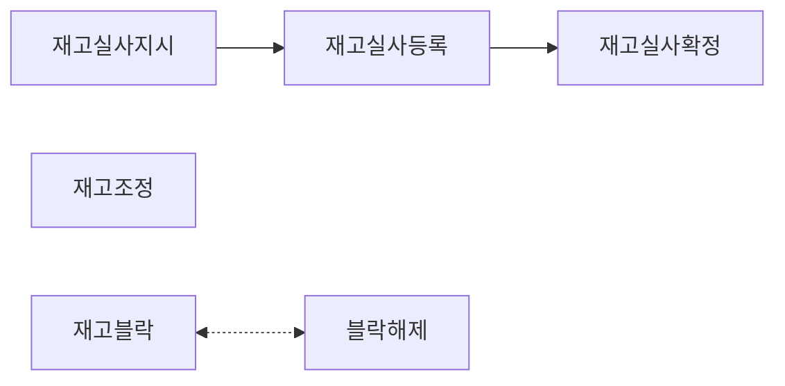

# 경북포항 스마트물류플랫폼 (PH_DO)

포스코 철강 물류 스마트플랫폼 백엔드. 재고관리 전체 담당 및 외부 설비(크레인) API 연동.

---

## 기술 스택

- **Backend**: Java 17, Spring Boot 3.2.5, MyBatis
- **DB**: MariaDB
- **기타**: SSE, Jasper Reports, Firebase
- **Build**: Gradle
- **Infra**: Docker, Jenkins

---

## 프로젝트 개요

| 항목 | 내용 |
|------|------|
| 기간 | 2024.07 ~ 2025.02 (약 8개월) |
| 팀 구성 | 런타임 5인 |
| 도메인 | 입고관리(IM) / 재고관리(SM) / 출고관리(OM) |

---

## 참고 사항

- 이 저장소는 포트폴리오 목적으로 코드 구조와 구현 내용을 공개합니다.
- 실제 운영 환경과 분리되어 있고, DB 스키마/데이터 및 일부 상용 라이브러리(paramquery-pro)가 포함되어 있지 않아 별도 환경 구성 없이는 직접 실행할 수 없습니다.
- 빌드 환경(참고): Java 17, Spring Boot 3.2.5, Gradle, MariaDB
- DB 접속정보 등 민감한 설정값은 `application.yml`에서 관리되며, 보안상 저장소에는 포함하지 않았습니다.

---

## 주요 기능

### 재고관리 (SM) - 주담당

- 재고조회 (전체 재고 그리드 조회)
- 선별지시 / 정보등록 / 완료확정
- 재고실사 / 재고조정 / 재고블락 / 블락해제
- 로케이션-크레인 매핑 관리 (선별 시 양방향 필터링 적용, 아래 트러블슈팅 참고)

### 입고관리 (IM) - 담당

- 입고예정확정 / 입고검수 (PC/태블릿) / 입고정보등록 / 입고완료확정
- 입고검수는 원래 PC 화면으로만 설계되어 있었으나, 현장 작업자가 직접 태블릿을 들고 검수해야 한다는 현업 요구에 따라 태블릿 전용 UI 화면 추가 개발

### 출고관리 (OM) - 일부 담당

- 출고계획 / 출고지시 / 출고완료확정
- 출고 차량이 정문을 통과하면 외부설비에서 통과 정보를 API로 전달하는데, 이를 출고 담당자 화면에 실시간으로 띄워달라는 현업 요청에 따라 SSE 기반 실시간 알림 적용

### 외부 설비 API 연동 - 서비스/쿼리 전담

- 입고/재고/출고 전 모듈의 API 코드와 URL이 곳곳에 흩어져 있으면 관리가 어려워서, 공통코드처럼 ApiInfo enum 하나로 모아 중앙 관리
- ApiConfig.requestToDC()로 DC 중계 서버 통해 외부설비(크레인) 연동
- 입고/출고는 조업시작 전에 정보등록/지시 단계가 있어 크레인이 이미 위치 정보를 알고 있어 별도 호출이 필요 없지만, 재고/선별은 사전 단계가 없어 조업시작 시점에 위치 정보를 알려줘야 해서 이때 호출
- 조업완료 시점에는 세 모듈 공통으로 최종 위치/완료 정보를 크레인 측에 전달

### 기타
- 물류 시스템 특성상 사고나 재고 데이터 꼬임에 대비한 일 단위 백업이 필요하다는 판단에 따라, prod 환경에서만 동작하는 일재고백업 스케줄러 구현

---

## 트러블슈팅

### 선별 작업 로케이션-크레인 케파 매핑 설계 누락
> 선별(적치) 작업 배정 시, 크레인마다 담당 케파(처리 가능 로케이션 범위)가 나뉘어 있는데도 기존 설계에는 이 매핑 관계가 반영되지 않아 실제로는 처리 불가능한 로케이션-크레인 조합도 선택 가능한 문제를 개발 중 직접 발견 → 로케이션-크레인 매핑 관리 화면 도입을 제안 및 구현해, 선별 시 한쪽을 지정하면 매핑된 값만 노출되도록 양방향 필터링 처리

- **문제**: 크레인마다 담당 케파(로케이션 범위)가 정해져 있는데, 기존 설계에는 로케이션-크레인 매핑 관계가 반영되지 않아 실제로는 처리 불가능한 조합도 선택 가능
- **발견 경위**: 개발 도중 직접 발견, 매핑 관리 화면 도입을 제안
- **해결**: 로케이션↔크레인 매핑 관리 화면 구현 — 선별 시 로케이션을 먼저 지정하면 매핑된 크레인만, 크레인을 먼저 지정하면 매핑된 로케이션만 노출되도록 양방향 필터링
- **결과**: 케파를 벗어난 처리 불가능한 조합 선택을 사전에 차단

### 외부 설비 API 파라미터 불일치
> 외부설비 API 연동 시, 파라미터 문제가 발생했으나 외부설비 측에서 책임 회피 → API 로그를 직접 추가해 파라미터를 기록함으로써 외부설비 측 문제임을 데이터로 입증

- **문제**: 외부설비 측에서 파라미터 문제가 없다고 주장
- **해결**: API 로그 직접 추가하여 파라미터 기록 → 데이터로 외부설비 측 문제임을 입증

### 단수 중복 오류 (DuplicateLayerException)
> 재고 적치 시, 동일 위치+단에 중복 적재가 가능해 데이터 무결성이 깨질 우려 → 동일 위치+단 체크 로직 추가 후 예외 처리로 중복 적재 사전 차단

- **문제**: 동일 위치/단에 재고 중복 적재 시도
- **해결**: 동일 위치+단 체크 로직 추가 후 예외 처리

### 입고예정확정 쿼리 성능 저하
> 입고예정확정 아이템 조회 시 약 3분 가량 소요되던 응답을 쿼리 최적화로 2초대까지 단축

- **문제**: 아이템 조회 시 약 3분 소요되는 느린 응답
- **해결**: 쿼리 최적화로 응답 속도를 2초대로 개선
